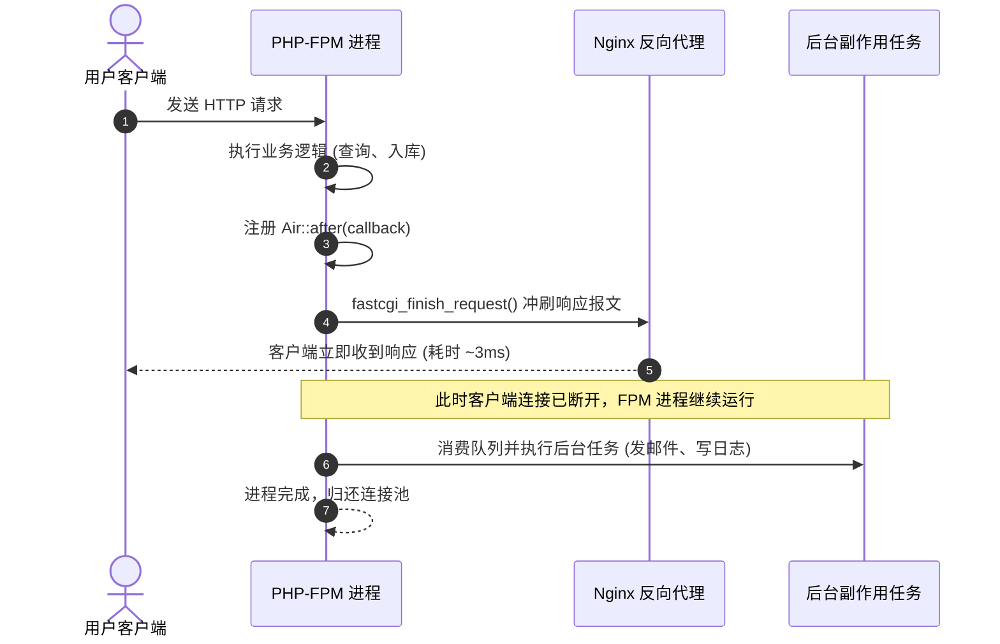

# 异步后置任务 (Air::after)

Next.js 15+ 引入了开创性的 `after()` API，允许服务端在将 HTTP 响应输出给用户后，继续在后台非阻塞地执行副作用任务（如日志持久化、发送邮件、埋点上报等）。

Meocox Air 将此哲学原汁原味引入 PHP，并利用 PHP-FPM 原生 `fastcgi_finish_request()` 实现了这一极致体验。

---

## 解决的问题

在传统的 PHP 接口中，发送一封验证邮件或通知可能需要耗费 500ms ~ 2000ms：

```php
// ❌ 传统写法：用户端浏览器必须卡顿等待 1.5 秒
function handleOrder() {
    $order = createOrder();
    sendNotificationEmail(); // 耗时 1500ms，拖慢整体响应
    return Response::json(['order_id' => $order->id]);
}
```

使用 `Air::after()`：
```php
// ✔️ Air 写法：用户端耗时 3ms 即收到响应，邮件在后台发送
use Meocox\Air;
use Meocox\Http\Response;

function handleOrder() {
    $order = createOrder();

    // 注册后置任务
    Air::after(function () use ($order) {
        // 这一步在 HTTP 响应冲刷给客户端之后运行！
        sendNotificationEmail($order);
        recordAuditLogs($order);
    });

    return Response::json(['order_id' => $order->id]);
}
```

---

## 执行机制



> [!IMPORTANT]
> - `Air::after()` 中的闭包任务若抛出异常，会被安全捕获并记录在系统错误日志中，**绝对不会破坏**已经发送给用户的成功响应。
> - 在 CLI 或独立运行模式下，`Air::terminate()` 会在脚本退出前同步清空后置任务队列。
