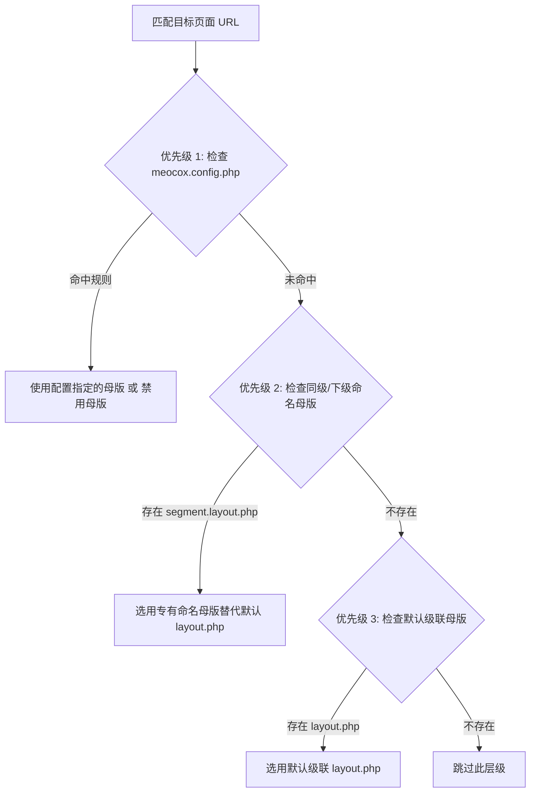

# 三级母版布局体系 (Layouts)

Next.js 的母版机制非常强大，但很多开发者对其**带小括号的路由组 `(auth)`** 导致的“文件夹层级过深、目录结构混乱”深感困扰；而 SvelteKit 的 `+page@.svelte` 语法又显得晦涩隐晦。

Meocox Air 独创了**三级母版解析引擎**，既保证了多层母版嵌套套娃的灵活性，又彻底消除了虚假文件夹地狱。

---

## 三级优先级解析链

当用户请求一个 URL 时，Air 的母版解析器遵循以下三级优先次序：



---

### 优先级 1：配置文件规则覆写 (`meocox.config.php`)

对于大屏展示、第三方嵌入或全屏 Canvas 等特殊页面，无需在目录里建多余的层级，直接在配置中声明：

```php
// meocox.config.php
'routing' => [
    'layouts' => [
        '/screen/*' => false,                 // 禁用 /screen 下所有外层母版
        '/embed/*'  => false,                 // 嵌入页面禁用母版
        '/print/*'  => 'print.layout.php',    // 统一强制使用打印母版
    ],
]
```

---

### 优先级 2：专有命名母版 (`{segment}.layout.php`)

这是消灭虚拟路由组的核心利器。当你在同一个目录下有多个子页面，但其中某个页面需要完全不同的母版时：

```text
app/routes/auth/
├── layout.php             # 默认 Auth 母版（两栏布局，带企业介绍插画）
├── login.layout.php       # 专有命名母版（单卡片居中极简布局）
│
├── login/
│   └── page.php           # 访问 /auth/login：优先匹配同级 login.layout.php！
└── register/
    └── page.php           # 访问 /auth/register：使用默认 layout.php！
```

> [!NOTE]
> 当解析到 `login` 路由段时，Air 发现父级目录存在 `login.layout.php`，则**自动用它替代默认的 `auth/layout.php`**，不会产生重复包裹，也无需为了登录页新建一个深层文件夹。

---

### 优先级 3：默认级联嵌套 (`layout.php`)

在默认情况下，母版自顶向下逐层套娃包裹：
- `root/layout.php`（包裹全局 `<html>`, `<body>`, 全局导航）
- `dashboard/layout.php`（包裹侧边栏菜单）
- `dashboard/settings/page.php`（具体内容）

渲染时，Air 会先渲染 `page.php`，然后将其作为插槽内容注入内层母版的 `$this->slot()`，最后再注入外层母版。

---

## 编写母版文件

在 `layout.php` 中，使用 `$this->slot()` 渲染子级内容：

```php
<!-- app/routes/layout.php -->
<!DOCTYPE html>
<html lang="zh-CN">
<head>
    <meta charset="UTF-8">
    <title>Meocox App</title>
</head>
<body class="bg-gray-50">
    <header class="navbar">...</header>
    
    <main class="container">
        <!-- 渲染子视图或内层母版 -->
        <?= $this->slot() ?>
    </main>

    <footer class="footer">...</footer>
</body>
</html>
```

---

## 独立页面跳出母版 (`$this->standalone()`)

如果你在一个具体的 `page.php` 或内层母版中需要临时打破外层所有母版包裹，只需调用：

```php
<!-- app/routes/dashboard/fullscreen/page.php -->
<?php $this->standalone(); ?>

<div class="fixed inset-0 z-50 bg-black text-white">
    <h1>沉浸式全屏展示</h1>
</div>
```
调用 `$this->standalone()` 后，Air 将立即停止向上层母版传递，直接输出当前页面的 HTML。
